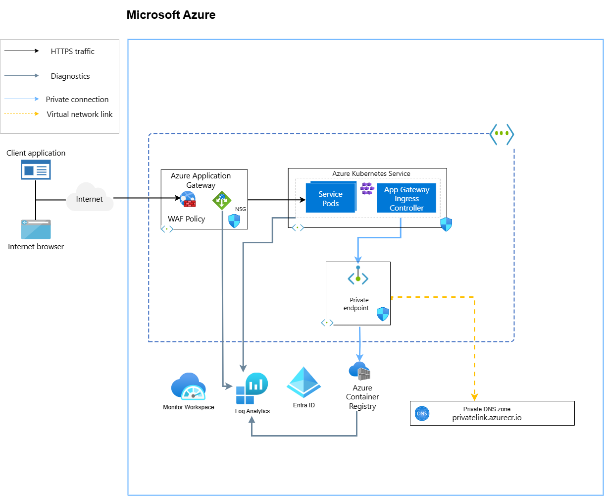

# Azure Kubernetes Service (AKS) Infrastructure with Terraform

This repository contains Terraform Infrastructure as Code (IaC) for deploying Azure Kubernetes Service (AKS) cluster with supporting infrastructure including networking, security, monitoring, and container registry.

## Table of Contents

1. [Overview](#overview)
2. [Architecture](#architecture)
3. [Prerequisites](#prerequisites)
4. [Infrastructure Components](#infrastructure-components)
5. [Directory Structure](#directory-structure)
6. [Configuration](#configuration)
7. [Deployment](#deployment)
8. [Network Security](#network-security)
9. [Monitoring and Diagnostics](#monitoring-and-diagnostics)
10. [Security Features](#security-features)
11. [Customization](#customization)
12. [Troubleshooting](#troubleshooting)

## Overview

This Terraform configuration deploys a production-ready AKS cluster with:
- Private Container Registry (ACR)
- Application Gateway with Web Application Firewall (WAF)
- Virtual Network with multiple subnets and Network Security Groups
- Azure AD integration for RBAC
- Log Analytics workspace for monitoring
- Private endpoints for secure connectivity

## Architecture

The infrastructure creates the following Azure resources:




## Prerequisites

### Software Requirements
- [Terraform](https://www.terraform.io/downloads.html) >= 1.0
- [Terragrunt](https://terragrunt.gruntwork.io/docs/getting-started/install/) (optional but recommended)
- [Azure CLI](https://docs.microsoft.com/en-us/cli/azure/install-azure-cli) >= 2.0
- [kubectl](https://kubernetes.io/docs/tasks/tools/install-kubectl/) (for cluster management)

### Azure Requirements
- Azure subscription with appropriate permissions
- Azure AD tenant access
- Resource group for Terraform state storage
- Storage account for remote state backend

### Permissions Required
- Contributor role on the subscription
- Azure Active Directory permissions to create groups
- Network Contributor permissions
- User Access Administrator (for role assignments)

## Infrastructure Components

### Core Components
- **Resource Group**: Central container for all resources
- **Virtual Network**: Network foundation with 3 subnets
- **AKS Cluster**: Kubernetes cluster with system and user node pools
- **Container Registry**: Private Azure Container Registry
- **Application Gateway**: Load balancer with WAF protection
- **Log Analytics**: Centralized logging and monitoring

### Networking
- **Virtual Network**: `185.21.4.0/23` address space
  - **AKS Subnet**: `185.20.24.0/21` - Kubernetes nodes
  - **Public Subnet**: `185.20.18.0/24` - Application Gateway
  - **Private Subnet**: `185.20.17.0/24` - Private endpoints

### Security
- **Network Security Groups**: Traffic filtering rules
- **Web Application Firewall**: OWASP protection
- **Private Endpoints**: Secure ACR connectivity
- **Azure AD Integration**: RBAC for cluster access
- **Managed Identity**: Secure authentication

## What is Terragrunt?

**Terragrunt** is a thin wrapper for Terraform that provides extra tools for keeping your Terraform configurations DRY (Don't Repeat Yourself), working with multiple environments, and managing remote state. It helps solve common Terraform challenges:

### Key Benefits:
- **Remote State Management**: Automatically configures backend state storage
- **Environment Management**: Easy promotion between dev/test/prod environments  
- **Code Reuse**: Share common Terraform code across multiple environments
- **Provider Generation**: Automatically generates provider and backend configurations
- **Dependency Management**: Handle dependencies between Terraform modules

### How It Works:
1. **Root Configuration**: Defines common settings (providers, backend, versions)
2. **Environment Configs**: Each environment has its own variable file
3. **Automatic Generation**: Creates provider.tf and backend.tf files automatically
4. **Variable Injection**: Passes environment-specific values to Terraform

## Directory Structure

```
.
├── 00-MAIN.TF                          # Main infrastructure resources
├── 03-DATA.TF                          # Data sources
├── 04-VARIABLES.TF                     # Input variables
├── 05-LOCALS-GLOBAL.TF                 # Global local values
├── 05-LOCALS-VNET.TF                   # Virtual network configuration
├── 06-LOCALS-SUBNET.TF                 # Subnet definitions
├── 07-LOCALS-SUBNET-NSG-RULES.TF       # Network security rules
├── 08-LOCALS-NSG-LOGS.TF               # NSG logging configuration
├── 09-LOCALS-PUBLIC-IP.TF              # Public IP configuration
├── 10-LOCALS-APP-GW.TF                 # Application Gateway settings
├── 11-LOCALS-WAF.TF                    # WAF policy configuration
├── 12-LOCALS-AKS.TF                    # AKS cluster configuration
├── 13-LOCALS-AKS-NODES.TF              # Node pool configurations
├── 14-LOCALS-ACR.TF                    # Container registry settings
├── 14-ROLES.TF                         # Role assignments
├── modules/                            # Terraform modules
│   ├── acr/                           # Container Registry module
│   ├── aks-cluster/                   # AKS cluster module
│   ├── aks-node-pool/                 # Node pool module
│   ├── application-gateway/           # Application Gateway module
│   ├── az-ad-group/                   # Azure AD group module
│   ├── diagnostic_setting/            # Diagnostics module
│   ├── private-dns-zone-link/         # DNS zone linking module
│   ├── private-endpoints/             # Private endpoint module
│   ├── virtual-network-subnet/        # Subnet module
│   └── waf-policy/                    # WAF policy module
└── terragrunt/                        # Terragrunt configuration
    ├── root.hcl                       # Root Terragrunt configuration
    └── tr-subscr/                     # Environment-specific configs
        ├── env.hcl                    # Environment variables
        └── terragrunt.hcl             # Environment Terragrunt config
```

## Configuration

### Terragrunt Configuration Structure

#### Root Configuration (`terragrunt/root.hcl`)
The root configuration defines common settings shared across all environments:
- **Provider Generation**: Automatically creates `provider.tf` with Azure provider
- **Version Constraints**: Defines required Terraform and provider versions  
- **Remote State Backend**: Configures Azure Storage for state files
- **Common Variables**: Reads environment-specific variables from `env.hcl`

#### Environment Configuration
Configure your environment in `terragrunt/tr-subscr/env.hcl`:

```hcl
locals {
    subscription_id                = "your-subscription-id"
    state_resource_group_name      = "your-state-rg"
    state_storage_account_name     = "yourstateaccount"
    state_container_name           = "states-tr"
    environment                    = "test"
}
```

### Key Configuration Options

#### AKS Cluster Settings
- **Kubernetes Version**: Default `1.33.2`
- **Node Pools**: System and user node pools with auto-scaling
- **Network Plugin**: Azure CNI
- **Private Cluster**: Configurable (default: false)

#### Network Configuration
- **Address Spaces**: Customizable CIDR blocks
- **Subnets**: Three-tier network design
- **DNS**: Custom DNS service IP configuration

#### Security Settings
- **RBAC**: Azure AD integration enabled
- **Network Policies**: Configured via NSG rules
- **Private Endpoints**: Secure ACR connectivity

## Deployment

### Using Terragrunt (Recommended)

1. **Navigate to environment directory**:
   ```bash
   cd terragrunt/tr-subscr
   ```

2. **Initialize and validate**:
   ```bash
   terragrunt validate
   terragrunt plan
   ```

3. **Deploy infrastructure**:
   ```bash
   terragrunt apply
   ```

4. **Connect to AKS cluster**:
   ```bash
   az aks get-credentials --resource-group <rg-name> --name <aks-name>
   kubectl get nodes
   ```

### Terragrunt Benefits for This Project

- **Automatic Backend Config**: No need to manually configure Azure Storage backend
- **Provider Management**: Automatically generates provider.tf with correct versions
- **Environment Isolation**: Each environment gets its own state file
- **DRY Configuration**: Reuse the same Terraform code across environments
- **Variable Management**: Environment-specific variables are cleanly separated

### Understanding Generated Files

When you run Terragrunt, it automatically creates:
- `provider.tf`: Azure provider configuration with subscription ID
- `backend.tf`: Remote state configuration pointing to Azure Storage
- `versions_override.tf`: Terraform and provider version constraints

These files are generated based on your `root.hcl` and `env.hcl` configurations.

### Using Terraform Directly

1. **Initialize Terraform**:
   ```bash
   terraform init
   ```

2. **Create terraform.tfvars**:
   ```hcl
   environment = "test"
   location = "westeurope"
   aks_version = "1.33.2"
   # Add other required variables
   ```

3. **Deploy**:
   ```bash
   terraform plan
   terraform apply
   ```

## Network Security

### Network Security Groups
Each subnet has dedicated NSG rules:

#### AKS Subnet Rules
- Allow internal AKS communication
- Allow Azure Load Balancer traffic
- Deny all other VNet traffic

#### Public Subnet Rules
- Allow HTTP/HTTPS (80, 443)
- Allow Gateway Manager traffic
- Allow Azure Load Balancer

#### Private Subnet Rules
- Allow subnet-to-subnet communication
- Allow Azure Load Balancer
- Deny external VNet traffic

### Web Application Firewall
- **Mode**: Prevention
- **Rule Set**: OWASP 3.2
- **Custom Rules**: Configurable IP-based blocking
- **Exclusions**: Customizable for specific applications

## Monitoring and Diagnostics

### Log Analytics Integration
- **AKS Diagnostics**: API server, audit, and controller logs
- **Network Diagnostics**: NSG flow logs and metrics
- **Application Gateway**: Access and firewall logs
- **Container Registry**: Authentication and repository events

### Metrics and Alerting
- Container Insights enabled for AKS
- Application Gateway metrics
- Network performance metrics
- Custom metric collection configurable

## Security Features

### Identity and Access Management
- **Azure AD Groups**: Separate groups for administrators, developers, and operations
- **RBAC**: Kubernetes role-based access control
- **Managed Identity**: User-assigned identity for AKS

### Network Security
- **Private Endpoints**: ACR accessible only within VNet
- **Network Segmentation**: Multi-subnet design
- **Traffic Filtering**: Comprehensive NSG rules

### Data Protection
- **Encryption**: Host encryption enabled on node pools
- **Private Registry**: ACR with private endpoint
- **Secure Communication**: Internal traffic protection

## Customization

### Adding New Node Pools
Create additional node pool configurations in `13-LOCALS-AKS-NODES.TF`:

```hcl
locals {
  aks_node_configuration_gpu = {
    kubernetes_cluster_id = module.aks_cluster.aks_id
    name                  = "gpunodes"
    vm_size              = "Standard_NC6s_v3"
    mode                 = "User"
    # Additional configuration...
  }
}
```

### Modifying Network Rules
Update NSG rules in `07-LOCALS-SUBNET-NSG-RULES.TF`:

```hcl
{
  name                       = "Allow_Custom_Port"
  priority                   = 105
  direction                  = "Inbound"
  access                     = "Allow"
  protocol                   = "Tcp"
  source_port_range          = "*"
  destination_port_range     = "8080"
  source_address_prefix      = "10.0.0.0/8"
  destination_address_prefix = "*"
}
```

### WAF Custom Rules
Add custom WAF rules in `11-LOCALS-WAF.TF`:

```hcl
{
  name             = "BlockMaliciousIPs"
  priority         = 1
  rule_type        = "MatchRule"
  match_conditions = [{
    match_variables = {
      variable_name = "RemoteAddr"
    }
    operator           = "IPMatch"
    negation_condition = false
    match_values       = ["192.168.1.0/24"]
  }]
  action = "Block"
}
```

## Troubleshooting

### Common Issues

#### AKS Cluster Creation Fails
- Verify Azure CLI authentication
- Check subscription permissions
- Ensure service principal has required roles

#### Network Connectivity Issues
- Review NSG rules for blocked traffic
- Verify subnet configurations
- Check private endpoint DNS resolution

#### ACR Access Problems
- Confirm private endpoint creation
- Verify DNS zone linking
- Check AKS-ACR role assignments

### Diagnostic Commands

```bash
# Check AKS cluster status
az aks show --resource-group <rg-name> --name <aks-name>

# Verify ACR connectivity
az acr check-health --name <acr-name>

# Review Application Gateway status
az network application-gateway show --resource-group <rg-name> --name <appgw-name>

# Check private endpoint status
az network private-endpoint list --resource-group <rg-name>
```

### State Management Issues

If using Terragrunt with remote state:

```bash
# Refresh state
terragrunt refresh

# Import existing resources
terragrunt import <resource_type>.<resource_name> <azure_resource_id>

# Force unlock state (use carefully)
terragrunt force-unlock <lock_id>
```

### Code Standards
- Follow Terraform naming conventions
- Document all variables with descriptions
- Include validation rules where appropriate
- Update README for significant changes